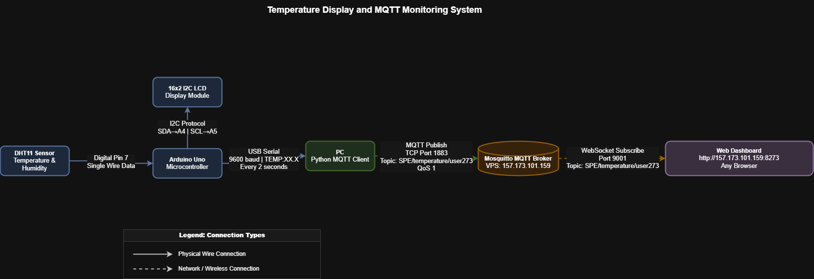

# Temperature Display and MQTT Monitoring System

**Candidate:** Bonnette Umurerwa 

---

## System Architecture



---

## How the System Works

The DHT11 sensor reads temperature every 2 seconds and sends it to the Arduino Uno, which displays the candidate name and temperature on the I2C LCD and transmits the value to the PC via USB serial. A Python client reads the serial data and publishes it to a Mosquitto MQTT broker on a Linux VPS. A web dashboard hosted on the same VPS subscribes to the MQTT topic and displays live temperature readings accessible from any browser.

---

## Core Functionalities

- DHT11 reads and sends temperature to Arduino every 2 seconds
- Arduino displays name and temperature on 16x2 I2C LCD
- Arduino transmits readings over serial at 9600 baud in format `TEMP:XX.X`
- Python client publishes readings to MQTT broker at `157.173.101.159:1883`
- MQTT topic: `SPE/temperature/user273`
- Web dashboard at `http://157.173.101.159:8273/index.html` shows live chart, current temperature, min, max and average

---

## How to Test

**1. Upload Arduino sketch**
Open `arduino/temperature_lcd.ino` in Arduino IDE, select board Arduino Uno and correct port, click Upload.

**2. Verify Arduino is working**
Open Serial Monitor at 9600 baud — you should see:
```
DHT11 Read OK - Temp: 23.0C
TEMP:23.0
```
Close Serial Monitor before next step.

**3. Run Python client**
```
pip install pyserial paho-mqtt
python pc_client/mqtt_client.py
```
You should see temperature being published every 2 seconds.

**4. Open the dashboard**
Go to any browser and open:
```
http://157.173.101.159:8273/index.html
```
Live temperature should appear and update automatically.

**5. Verify MQTT on VPS**
```
ssh user273@157.173.101.159
mosquitto_sub -h localhost -p 1883 -t "SPE/temperature/user273" -v
```
You should see temperature values arriving every 2 seconds.

---

*Dashboard: http://157.173.101.159:8273/index.html*